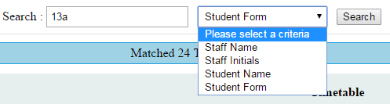

**School Timetable Lookup**
School Timetable Lookup

Uses SIMS CSV Report > Powershell Script > XML Files > Web HTML & JS to allow staff and students to lookup timetables.

Web based utility that uses SIMS data for to allow for school staff and students to lookup their timetable.

This was built as a replacement for a custom VB program that had become outdated. The original program would allow you to search for staff initials or student details and show their timetable. This uses a similar lookup function against an xml file which is created by processing a SIMS report with a powershell script.

Brief data flow:

Run reports on SIMS to extract timetable data (individual for staff and students)
Run the exported data through the associated powershell file (staff or students)
This creates an XML file.

Meanwhile:
On a webserver you host the html and javascript files.
Copy the XML to the lookup location.
Use the HTML to lookup.

Our timetable is a 2 week, 6 period system. All powershell and html/js will need adapting to your timetable. We will try our best to help if people get stuck with this. We have created a full user manual for the default setup which will point out some of the code which you may need to change.

